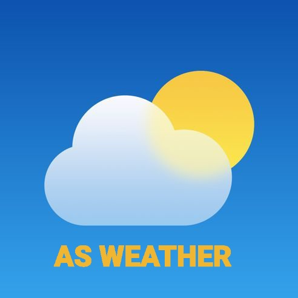

# 🌤️ AS-DEV Weather - Progressive Web App

## 📋 **Overview**
A beautiful, feature-rich weather Progressive Web App with real-time forecasts, moon phases, Islamic calendar, air quality index, and interactive radar. Works offline and installs like a native app.

🔗 **Live Site:** [asdeveloperszone.github.io/Wea/](https://asdeveloperszone.github.io/Wea/)

---

## ✨ **Core Features**

| Category | Features |
|----------|----------|
| **🌤Weather** | Current conditions, 7-day forecast, 24-hour hourly, feels like, humidity, wind, UV index |
| **🌙 Moon** | Real-time moon phases, illumination %, next full/new moon, stargazing quality |
| **☀️ Sun** | Sunrise/sunset, day length, solar noon, visual sun position tracker |
| **☪️ Islamic** | Hijri date conversion, Islamic month names, moon sighting info |
| **🌍 Air Quality** | Real-time AQI, PM2.5/PM10/O₃/NO₂ levels, health recommendations |
| **🗺️ Maps** | Interactive radar with temperature, rain, wind layers (Leaflet.js) |
| **📍 Locations** | Search cities, save favorites, geolocation support |
| **🎨 UI/UX** | Dark/light theme, °C/°F toggle, weather-based animations |

---

## 📱 **PWA Features**

| Feature | Description |
|---------|-------------|
| **Installable** | Add to home screen (Android/iOS/Desktop) |
| **Offline Mode** | Works without internet, cached data |
| **Splash Screen** | Custom branded launch screen |
| **Fullscreen** | Native app experience, no browser UI |

### **How to Install**
- **Android:** Chrome menu → "Add to Home screen"
- **iPhone:** Safari share → "Add to Home Screen"
- **Desktop:** Click install icon in address bar

---

## 🛠️ **Tech Stack**

| Technology | Purpose |
|------------|---------|
| HTML5/CSS3 | Structure & styling (vanilla, no frameworks) |
| JavaScript | All functionality (ES6+) |
| **Open-Meteo API** | Weather & air quality data |
| **Nominatim** | Geocoding & reverse geocoding |
| **Aladhan API** | Islamic calendar conversion |
| **Leaflet.js** | Interactive radar maps |
| **Font Awesome** | Icons |
| **Google Fonts** | Syne & DM Mono typography |

---

